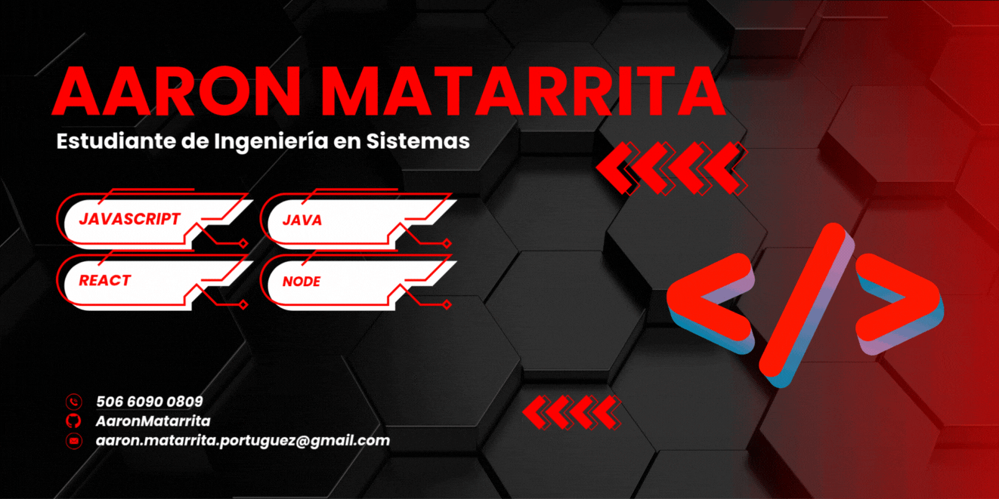

<h1 align="center">¡Hola! Soy Aaron Matarrita </h1>

  

---

## 🙋‍♂️ Sobre mí

¡Pura vida! Soy **Aaron Matarrita Portuguez**, estudiante apasionado de **Ingeniería en Sistemas** en la **Universidad Nacional de Costa Rica (UNA)**, proveniente de **Sarapiquí, Heredia** 🇨🇷. Actualmente curso mi cuarto año, siempre con la motivación de seguir aprendiendo, compartiendo y creciendo profesionalmente como desarrollador.

- 💻 Apasionado por el **desarrollo de software** y las tecnologías emergentes.
- 🧠 Amante del aprendizaje continuo y la resolución de problemas.
- 🤝 Disfruto colaborar en proyectos con impacto real y valor profesional.

---

## 🚀 Tecnologías y herramientas

### 💻 Lenguajes de Programación

  
  
  
  

### 🌐 Frameworks y Back-end

  
  

### 🗄️ Bases de Datos

  
  

### 🧰 Herramientas y Entornos

  
  
  

### 🔍 Testing y APIs

  
  

### 🎨 Diseño y Productividad

  
  
  

### 🧑‍💻 Metodologías y Control de versiones

  
  
  

---

## 🌟 Proyecto Destacado

  
  

### 🛒 Sistema de Gestión de Inventario y Ventas

Proyecto académico desarrollado a lo largo de **Ingeniería en Sistemas I, II y III** durante **1 año y medio**, en colaboración con **3 compañeros**, orientado a cubrir las necesidades de una tienda real.

📌 **Características principales:**
- Gestión de productos, proveedores y clientes.
- Registro y control de ventas.
- Interfaz de escritorio amigable usando **Electron**.
- Panel de administrador en React para una experiencia moderna y fluida.
- Backend robusto con Node.js y Express.

🛠 **Tecnologías utilizadas:**  
`React`, `Node.js`, `Express`, `Electron`, `CSS`

🤝 **Trabajo colaborativo:** Proyecto desarrollado en equipo, fomentando buenas prácticas de control de versiones, comunicación efectiva y metodologías ágiles.

🔗 **Repositorio:** [SistemaInventarioTienda](https://github.com/SistemaInventarioTienda/SistemaInventarioTienda)

---

## 📈 Mis estadísticas en GitHub

  

  <picture>
    <source srcset="https://github-readme-stats.vercel.app/api/top-langs/?username=AaronMatarrita&layout=compact&langs_count=8&theme=radical" media="(prefers-color-scheme: dark)" />
    <source srcset="https://github-readme-stats.vercel.app/api/top-langs/?username=AaronMatarrita&layout=compact&langs_count=8&theme=default" media="(prefers-color-scheme: light), (prefers-color-scheme: no-preference)" />
    
  </picture>

---

## 📬 ¡Conectemos!

¿Tienes una idea, proyecto o simplemente deseas charlar sobre tecnología? ¡Estoy abierto a nuevas oportunidades y conexiones!

- 📧 **aaron.matarrita.portuguez@est.una.ac.cr**
- 💼 [LinkedIn](https://www.linkedin.com/in/aaron-matarrita-portuguez-5b166a367)

---

  <em>“Aprender no es llenar un balde, sino encender un fuego.” – William Butler Yeats 🔥</em>

